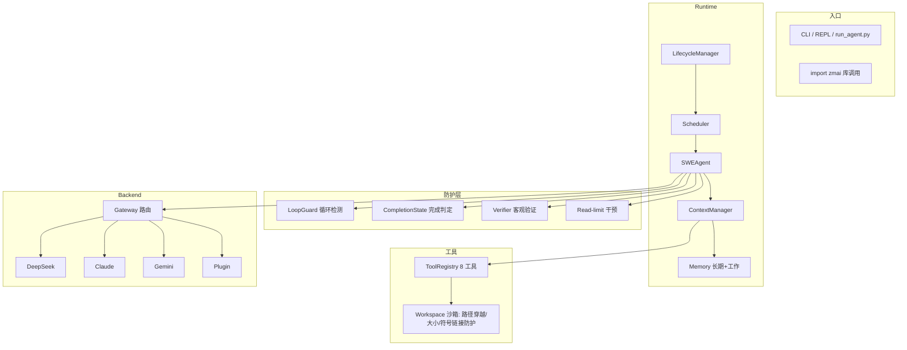

# ZMAI 开源审计报告 (OPEN_SOURCE_AUDIT_REPORT.md)

**审计时间**: 2026-08-06
**审计对象**: D:\desk\ZMAI (v0.1.0)
**审计方式**: 实际代码审阅 + 实际测试执行 (1245 passed / 7 skipped) + SWE Agent 真实验证 + Autostop 真实验证

---

## 1. 当前项目成熟度评级

### 评级：**Beta**（接近 Production，但未达开源发布门槛）

| 维度 | 证据 | 评价 |
|------|------|------|
| 功能完整性 | 100 个模块文件 / ~20,700 行，SWE Agent 8 工具、3 后端+插件、REPL、CLI、Issue 集成、SWE-bench 管线、Docker 沙箱全部有实现 | ✅ 完整 |
| 测试 | 48 个测试文件 / **1252 collected / 1245 passed / 7 skipped**，含回归测试；实测发现并修复 P0 bug 后有回归测试防回退 | ✅ 强 |
| 真实能力 | SWE Agent 真实运行：读 ISSUE → 先跑测试 → 定位 → 改代码 → 验证 → 自动停止（6 步完成，4/4 测试通过） | ✅ 已验证 |
| 工程规范 | CI (GitHub Actions 双 OS × 3 Python)、pre-commit API key 检测、Keep a Changelog、SemVer、SECURITY.md 完整、docs/ 含 ARCHITECTURE.md + 20+ 设计文档 | ✅ 规范 |
| 发布状态 | dist/ 有 0.1.0 构建产物，但 **git 仓库 0 commit**、未发布 PyPI、无真实用户 | ❌ 未开源 |
| 基准数据 | BENCHMARK.md 旧数据已作废（20% 成功率 + Token 0 不可复现），已重写为正式 benchmark 状态说明（✅ 已解决 2026-08-07） | ✅ 已解决 |
| 文档一致性 | README 宣称 "600+ tests"（实际 1252）等数字过时；Demo 区 GIF 为 TODO | ⚠️ 待更新 |

**结论**: 代码与测试达到 Beta 上沿，但"git 零提交 + 基准无效 + 文档数字过时"三项使其**尚未达到开源发布标准**。整理后 1-2 天可达标。

---

## 2. GitHub 开源前必须补充的内容

按优先级排序（P0 = 阻塞开源，P1 = 强烈建议）：

### P0（阻塞）
1. **git init + 首次提交 + 打 tag**
   - 现状：`git status` 显示全部文件 untracked，branch master 无任何 commit
   - 动作：`git add -A && git commit`（注意先补 .gitignore 排除 workspace/、logs/、dist/ 等）
   - 打 `v0.1.0` tag 触发 publish workflow
2. **修复 README 过时数字**
   - "600+ tests" → 实际 **1252 collected / 1245 passed**
   - "Zero dependencies" 声明核实（pyproject dependencies=[] 属实 ✅）
3. **处理无效的 BENCHMARK.md**
   - 20% 成功率 + 0 token 的旧数据（2026-07-29）会吓退评估者，且无法复现 → ✅ 已解决（2026-08-07 重写为正式状态说明，声明 SWE-bench 未评测 + 保留真实验证）
   - 选项 A：删除，改为 "SWE-bench Lite 评估中"
   - 选项 B：用真实 API 重跑 5 任务 benchmark，发布真实数据

### P1（强烈建议）
4. **Demo GIF**（README 中 `<!-- TODO: add GIF demo -->`）
   - 用 LICEcap/obs 录 30 秒：一条命令修复 bug 的完整过程
5. **补一张 Mermaid 架构图**（见第 4 节）
6. **真实 API 验证的 E2E 测试标记**
   - tests/test_live_api.py 在 CI 中被 `--ignore`，README 应说明哪些测试需要 key
7. **发布后验证**：`pip install zmai` 干净环境 smoke test（当前只在本机 .venv 验证过）

---

## 3. README 缺失项

现有 README 已覆盖：简介、Quick Start、后端对比表、CLI 参考、架构 ASCII 图、零依赖论证、状态清单、License。**缺失**：

| 缺失项 | 建议 |
|--------|------|
| 真实效果展示 | Demo GIF / 前后对比截图（修复前失败 → 修复后通过） |
| 安装前置条件 | claude CLI 版本要求（run_agent.py 依赖）、DeepSeek/Anthropic key 获取地址 |
| API Key 配置流程 | 目前只在 Quick Start 提 `export DEEPSEEK_API_KEY`；应补充 `zmai auth setup` 向导 + Credential Store 加密说明（key 存 ~/.zmai/credentials，密钥文件 credentials.key） |
| 安全模型说明 | **必须**：shell_exec 直接执行任意命令（无头模式无确认回调）；--skip-permissions 是无边界模式；Edit/Write 有路径穿越防护；凭证是本地混淆加密（密钥与密文同机） |
| 自主停止机制 | 亮点功能（CompletionState + LoopGuard + max_steps）应写成 Feature 一节，这是区别于普通 LLM 调用的卖点 |
| 开发环境搭建 | `pip install -e ".[dev]"` + 如何跑测试 + 如何跑 SWE-bench |
| 项目结构导览 | src/zmai/ 各子包职责一览表 |
| 贡献者指南链接 | CONTRIBUTING.md 已有，README 需链接 |
| Roadmap | 现状无；开源项目必须有公开 Roadmap（见第 7 节） |
| 已知限制 | 无头模式依赖 claude CLI 登录态；Windows 路径/编码注意事项（项目已有处理，值得记录） |

---

## 4. 架构图建议

现有 README 架构图只有 3 层（Runtime Core / Gateway / Backend），**遗漏了最核心的 Agent 内部防护层**。建议替换为：

### 建议 1：运行时架构（Mermaid）


### 建议 2：执行生命周期图（README Feature 节）
```
任务 → [Phase1 发现] → [Phase2 先跑测试] → [Phase3 分析失败] → [Phase4 修改代码] → [Phase5 验证]
                                                                              ↓
                                                             测试全绿 → CompletionState → 自动停止
                                                             5步无进展 → LoopGuard 干预
                                                             超过 max_steps → Runtime 强制终止
```

### 建议 3：docs/ARCHITECTURE.md 升级
- 现状文件存在但应补：状态机图（created→executing→completed/timeout/failed/cancelled）、凭证解析优先级图（CLI > env > config > credential store）、上下文压缩策略（ContextManager.compact）

---

## 5. 安全风险检查

基于代码审计（非泛泛）：

| # | 风险 | 级别 | 证据 | 建议 |
|---|------|------|------|------|
| 1 | **shell_exec 直接执行任意命令** | **P0** | tools.py ShellTool.execute 直接 subprocess.run(shell=True)；无头模式无 on_confirm 回调时无任何确认 | 开源前必须在 README/SECURITY.md 声明；建议默认注入只读提示或提供 sandbox 配置开关（Docker 沙箱已实现但非默认，见 workspace/docker.py） |
| 2 | run_agent.py `--dangerously-skip-permissions` 无边界 | P0 | run_agent.py build_claude_command 显式支持 | 保留（有注释警告）但 README 必须高亮"仅限可信环境" |
| 3 | 凭证"加密"实为本地混淆 | P1 | store.py `_resolve_key`: 密钥与密文同机存储（~/.zmai/credentials.key + credentials），是 obfuscation 非真正加密（但优于明文 ✅，有 chmod 600 + 防 key 日志泄漏测试 ✅） | 文档明确此模型；声称"加密存储"时加"本地密钥"限定词 |
| 4 | claude CLI 未登录时静默失败 | P1 | run_agent.py 返回 status=failed + "Not logged in"，无前置检查 | 增加登录检测（`claude auth status`）与友好报错 |
| 5 | process_result.json 固定路径 | P2 | run_agent.py LOG_FILE 硬编码，并发实例互相覆盖 | 改为 workspace 内或时间戳命名 |
| 6 | 测试特权假设 | P2 | test_init_with_unwritable_dir 在 Windows 管理员下失败（System32 可写） | 测试用 tmp_path + 权限模拟，避免依赖系统路径 |
| 7 | 供应链 | ✅ 低 | dependencies=[]，纯 stdlib | 无 |
| 8 | 路径穿越防护 | ✅ 有 | workspace.py relative_to 检查、agent_id 防 ../、tools.py _resolve_tool_path 限定 project_path/workspace | 建议补充公开的威胁模型文档 |
| 9 | API key 泄漏防护 | ✅ 有 | 测试 test_api_key_not_in_log / to_dict_no_api_key_leak；pre-commit 钩子 | 无 |

**安全底线结论**: 无依赖 + 路径穿越防护 + key 不泄漏测试，基础安全良好；**P0 项是 shell 执行边界声明**，属于文档与策略问题而非代码漏洞。

---

## 6. SWE Agent 项目是否具备简历价值

### 结论：**是，且含金量较高**（对软件工程求职/升学）

**加分项（实际证据）**：
1. **完整自主 Agent 闭环**：不是套壳调 API —— 自主停止（CompletionState + test_success_count 硬终止）、循环防护（LoopGuard 三模式）、客观验证（auto_verify）、read-limit 干预，这些是 LLM 应用工程里的**高阶话题**，面试可深挖
2. **零第三方依赖**：20,700 行纯 stdlib（urllib/subprocess/pathlib/json），展示底层能力（HTTP 调用、进程管理、加密、状态机全手写）—— 面试官会眼前一亮
3. **测试工程素养**：1252 测试 / 48 文件 / 回归测试文化（本次审计中发现 P0 bug → 修复 → 补 4 个防回退测试，本身就是可讲的故事）
4. **工程规范完整**：CI 矩阵、pre-commit、Changelog、SemVer、SECURITY.md、设计文档体系
5. **多后端抽象**：DeepSeek/Claude/Gemini/Plugin 四后端 + Credential Store + 多源配置，展示架构抽象能力
6. **真实验证**：SWE Agent 真机跑通修复任务（可录屏演示，答辩素材）

**需注意**：
- 竞争力取决于 LLM API 成本（无 key 无法演示）→ 面试演示用 DeepSeek（便宜）
- 旧 20% benchmark 数据已从 BENCHMARK.md 移除（不可复现）；对外展示用 BENCHMARK.md 状态说明中的真实验证 + "修复 demo 真实录屏"
- 建议简历措辞："自主软件工程 Agent 运行时（零依赖），实现完成判定、循环防护、验证闭环，1250+ 测试"——一句话讲清原理（符合用户答辩风格）

**定位建议**: 这是"AI 应用层工程"项目，适合投 AI 应用/后端/平台工程岗；简历价值 > 单纯调 API 的 demo 项目。

---

## 7. 下一阶段开发路线

### Phase 1：开源发布准备（1-2 天）
- [ ] git init + .gitignore 补全（workspace/, logs/, dist/, *.pyc, .pytest_cache）+ 首次提交 + tag v0.1.0
- [ ] README 更新：1252 tests、Demo GIF、安全模型声明、Roadmap 节
- [ ] 处理 BENCHMARK.md（删除或真实重跑）
- [ ] 发布 PyPI（workflow 已配好 trusted publishing，需 PYPI_API_TOKEN secret）
- [ ] `pip install zmai` 干净环境 smoke test

### Phase 2：工程加固（1 周）
- [ ] run_agent.py: claude CLI 登录检测 + 友好报错 + LOG_FILE 唯一化
- [ ] ShellTool: 默认命令白名单/只读模式开关（或文档明确沙箱策略）
- [ ] 修复 test_init_with_unwritable_dir 的 Windows 特权假设
- [ ] EditTool regex_replace 模式审计（本次只修了 replace_lines/insert）
- [ ] 真实 API 重跑 SWE-bench 5 任务，发布真实 benchmark

### Phase 3：能力提升（2-4 周）
- [ ] SWE-bench Lite 完整评估（README 已宣称 🚧，跑通后是最大卖点）
- [ ] 上下文压缩策略增强（ContextManager.compact 目前简单截断）
- [ ] 并行多 Agent 任务编排（Scheduler 已有 max_concurrent，补 demo）
- [ ] Docker 沙箱默认启用选项（安全卖点）
- [ ] 增加 Windows/Linux 双平台 CI 已覆盖 ✅，补 macOS

### Phase 4：社区（持续）
- [ ] 第一个真实用户 issue 响应流程验证
- [ ] 贡献者 onboarding 文档（GOOD_FIRST_ISSUE 标签）
- [ ] 版本节奏：每 2 周 minor，SemVer 严格

---

## 附：审计依据

- 测试: `pytest -q` → 1245 passed / 7 skipped（2026-08-06）
- SWE 验证: swe_fix_demo 修复前 2 failed → 修复后 4/4 passed, 6 步自动停止
- Autostop 验证: 可完成 4 步 complete / 不可完成 5 步 timeout（max_iterations=5）
- 代码规模: src/zmai 100 文件 20,700 行 / tests 48 文件
- 构建产物: dist/zmai-0.1.0 (tar.gz + whl)
- 仓库状态: git 0 commit, 全部 untracked
