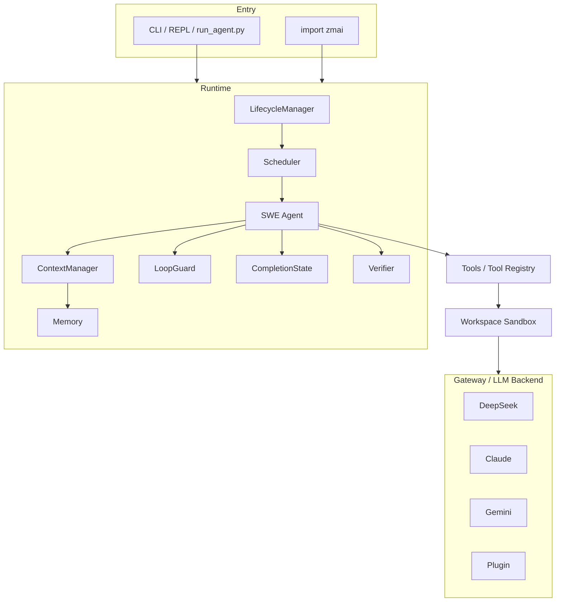

<div align="center">

# ZMAI

**Autonomous Software Engineering Agent Runtime**

[](https://github.com/xijingliu/ZMAI/actions/workflows/test.yml)
[](https://www.python.org/)
[](LICENSE)
[](pyproject.toml)

`pip install zmai` · **Zero third-party dependencies** · **1245 tests passing**

</div>

---

## 中文介绍 · ZMAI

ZMAI 是一个**开源自主软件工程 Agent Runtime（自主软件工程 Agent 运行时）**。
给它一个任务（"修复这个 Bug"、"增加这个功能"、"重构这个模块"），它会自主完成：

```
Issue 分析 → 任务规划 → 代码修改 → 自动测试验证 → 完成状态判断 → 自主停止
```

**它不是简单的 LLM API 封装** —— 从问题理解、测试驱动的调试、代码修改、
验证闭环到完成检测与自主停止，整个 Agent 循环都在本项目内实现。

### 🧩 核心能力

- **SWE Agent 工作流闭环** — 发现 → 先跑测试 → 分析失败 → 修改代码 → 验证
- **Completion Detection（完成状态检测）** — 跨轮累积判定，测试全绿立即停止
- **LoopGuard 循环保护** — 相同调用 / 相同失败 / 无进展 三重循环检测
- **Workspace Sandbox** — 路径穿越防护、文件大小限制、符号链接检测
- **Multi-model Gateway** — DeepSeek / Claude / Gemini / 自定义插件

### ✨ 技术亮点

- **零第三方依赖** — 约 2 万行纯 Python 标准库实现（urllib / subprocess / pathlib / json）
- **多后端抽象** — 统一 Backend 接口 + Credential Store 加密凭证存储
- **客观验证（auto_verify）** — 不因"工具调用成功"就判定任务完成
- **自主停止** — CompletionState + LoopGuard + max_iterations 硬上限三层防护
- **Windows 友好** — 内置 Linux→Windows 命令翻译与 UTF-8 编码处理

### ✅ 验证结果

- **1245 tests passed, 7 skipped**（48 个测试文件，无需 API Key 即可运行）
- **SWE Agent 实际任务验证通过** — 真实运行修复任务：读 Issue → 定位 Bug → 修改代码 → 测试从失败变全绿 → 自动停止
- **Autostop 自主停止机制验证通过** — 可完成任务自动停止；不可完成任务达到最大迭代强制终止，无无限循环

---

## What is ZMAI?

ZMAI is an **Autonomous Software Engineering Agent Runtime** — a software
engineer you run on your own machine. Give it a task ("fix this bug", "add
this feature", "refactor this module") and it plans, debugs, writes code, runs
tests, and stops on its own.

ZMAI is **not** a thin API wrapper. The agent loop — understanding the issue,
driving with test failures, modifying code, verifying results, detecting
completion, and stopping autonomously — is implemented in this repository:

```
Issue understanding  →  Test-driven debugging  →  Code modification
        ↓                        ↓                        ↓
  Completion detection  ←  Verification loop  ←  Autonomous stopping
```

Unlike cloud-only agents (Devin, Copilot), ZMAI is:

- **💨 Local & private** — code never leaves your machine
- **🔌 Provider-agnostic** — swap between Claude, DeepSeek, Gemini at runtime
- **📦 Zero dependencies** — pure Python stdlib, no `requests`, no `httpx`, no `pydantic`
- **🧩 Embeddable** — `import zmai` and use it as a library

---

## Features

### Multi-backend Gateway

- Unified backend abstraction for **DeepSeek / Claude / Gemini**
- Plugin API — write a 20-line Python file to add any LLM provider
- Credential Store with encrypted local storage (`zmai auth setup`)
- Multi-source config resolution (file → env → CLI)

### Agent Runtime

- Lifecycle management (`created → executing → completed / timeout / failed / cancelled`)
- Scheduler with concurrent agent execution
- Working memory + long-term memory (JSONL) with restore/persist
- Context manager with compaction

### SWE Agent Core

- 5-phase workflow: **Discover → Run Tests First → Analyze → Modify → Verify**
- Objective verification (`auto_verify`) — completion is not claimed on tool success alone
- Windows-aware command translation (no `ls`/`cat`/`grep` on Windows)

### Tool Registry

- 8 tools: `read_file`, `write_file`, `edit`, `grep`, `shell_exec`, `git`, `show_to_user`, `open_in_browser`
- Registered and routed by a central `ToolRegistry`; unknown/hallucinated tool
  names return structured errors instead of crashing
- Shared `ToolContext` (workspace path, project path, timeout) for every tool

### Autonomous Control

- **LoopGuard** — detects identical calls, identical failures, and no-progress loops
- **CompletionState** — cross-turn completion detection; stops immediately once tests are green
- Hard stop after `max_iterations`; read-limit intervention (8 reads without running tests)

### Workspace Sandbox

- Per-agent isolated directory (`input/`, `output/`, `temp/`, `.state/`)
- Path traversal protection, symlink detection, file size limits
- Optional Docker sandbox for command execution

### Extras

- CLI: `zmai` REPL, `zmai doctor`, `zmai config`, `zmai auth`, `zmai plugin`, `zmai issue`, `zmai pr`
- GitHub Issue integration and SWE-bench Lite evaluation pipeline
- Zero-dependency design (stdlib only) — small audit surface, no lock files

---

## Test Status

```
pytest

1245 passed, 7 skipped
```

- 48 test files covering auth, credential store, gateway, runtime, loop guard,
  termination, workspace security, SWE workflow, CLI, and more
- CI runs on Ubuntu + Windows × Python 3.10/3.11/3.12
- API keys not required for the suite (mocked backends)

---

## Demo

<!-- TODO: Add Demo GIF -->

A complete SWE workflow:

```
Issue
  ↓
Analysis
  ↓
Testing       ← run tests first, see the failures
  ↓
Fix           ← minimal, targeted code changes
  ↓
Verification  ← re-run tests, confirm green
  ↓
Completion    ← autonomous stop, no further tool calls
```

Example — one-shot fix a real bug:

```bash
zmai "Fix the ValueError in parse_config() — the function crashes on empty input"
```

---

## Architecture



**Layer flow**: `CLI/API → Runtime → SWE Agent → Tools → Workspace → Gateway → LLM Backend`

1. **CLI/API** — REPL, one-shot tasks, `run_agent.py`, or `import zmai`
2. **Runtime** — lifecycle, scheduler, memory, state management
3. **SWE Agent** — workflow engine + LoopGuard / CompletionState / Verifier
4. **Tools** — read/write/edit/grep/shell/git via ToolRegistry
5. **Workspace** — isolated sandbox with path traversal protection
6. **Gateway** — backend abstraction & routing
7. **LLM Backend** — DeepSeek / Claude / Gemini / any plugin

- **Zero dependencies** — only `urllib`, `subprocess`, `pathlib`, `json` from stdlib
- **Sandboxed workspace** — path traversal protection, file size limits, symlink detection
- **Autonomous stopping** — CompletionState + LoopGuard + hard `max_iterations` limit

---

## Quick Start

### Install (development)

```bash
git clone https://github.com/xijingliu/ZMAI.git
cd ZMAI
python -m venv .venv
.venv/Scripts/activate          # Windows; on Unix: source .venv/bin/activate
pip install -e ".[dev]"
```

### Run tests

```bash
pytest -v
```

### Configure your API key

```bash
zmai auth setup        # interactive wizard → stores key in encrypted Credential Store
```

Or set the environment variable directly:

```bash
export DEEPSEEK_API_KEY=***        # or ANTHROPIC_API_KEY / GEMINI_API_KEY
```

### Run the agent

```bash
# Embedded runtime (recommended)
zmai "Create hello.py and run it"

# Headless driver (uses Claude Code CLI)
python run_agent.py --workspace ./workspace --prompt agent_prompt.txt

# Interactive REPL
zmai
zmai> Read src/main.py and explain the architecture
```

---

## Supported Backends

| Backend | Default Model | Notes |
|---|---|---|
| **DeepSeek** | `deepseek-chat` | Low cost, OpenAI-compatible |
| **Claude** | `claude-sonnet-4-6` | Anthropic Messages API |
| **Gemini** | `gemini-2.0-flash` | Free tier available |
| **Plugin** | *any* | Bring your own backend |

---

## CLI Reference

```
zmai                            Interactive REPL
zmai "task"                    Run one task
zmai --backend deepseek "task" Use specific backend
zmai --json "task"             JSON output
zmai doctor                    Environment diagnosis
zmai config set key value      Change settings
zmai auth setup                Configure API keys
zmai plugin install path.py    Add custom backend
zmai issue <url>               Fetch and fix a GitHub issue
zmai pr <title>                Create a pull request
zmai eval swebench             Run SWE-bench Lite evaluation
```

---

## Security

ZMAI runs LLM agents that read, modify, and execute code. Read this before use.

- **Workspace path isolation** — `write_file` / `edit` are confined to the
  project path or workspace; path traversal (`../`) and symlink escapes are
  rejected. See `src/zmai/swe/tools.py` and `src/zmai/workspace/workspace.py`.

- **API key leak protection** — credentials are stored encrypted in
  `~/.zmai/credentials` (local key file `credentials.key`, permissions 600);
  API keys are excluded from serialization and logs (regression-tested); a
  pre-commit hook scans for leaked keys.

- **Shell execution warning** — `shell_exec` runs commands directly on your
  machine. In interactive mode a confirmation callback can gate execution;
  in headless mode there is **no confirmation prompt**. Treat the agent as a
  trusted contributor with shell access.

- **Permission model** — `run_agent.py` defaults to a restricted tool
  allowlist scoped to the workspace (`Read, Edit(<ws>/**), Write(<ws>/**)`).
  `--skip-permissions` enables `--dangerously-skip-permissions` (unbounded
  shell + file access) — **only in trusted environments**.

- **Credential note** — local encryption protects against casual reads, but
  the key file lives on the same machine. This is obfuscation, not hardware
  security.

Report vulnerabilities privately per [SECURITY.md](SECURITY.md).

---

## Roadmap

**v0.1.0 (current)**

- Agent runtime with lifecycle, scheduler, memory
- SWE workflow (discover → test-first → fix → verify)
- Verification loop + autonomous stopping
- Multi-backend gateway (DeepSeek / Claude / Gemini / plugin)

**Future**

- Better sandbox — Docker sandbox by default, command allowlists
- Multi-agent — parallel task orchestration
- SWE-bench evaluation — publish real SWE-bench Lite results
- Context compaction strategies
- macOS CI coverage

---

## Contributing

See [CONTRIBUTING.md](CONTRIBUTING.md) and [CODE_OF_CONDUCT.md](CODE_OF_CONDUCT.md).
Changes follow [CHANGELOG.md](CHANGELOG.md) (Keep a Changelog, SemVer).

---

## License

MIT © [Xijing Liu](https://github.com/xijingliu) — see [LICENSE](LICENSE).
