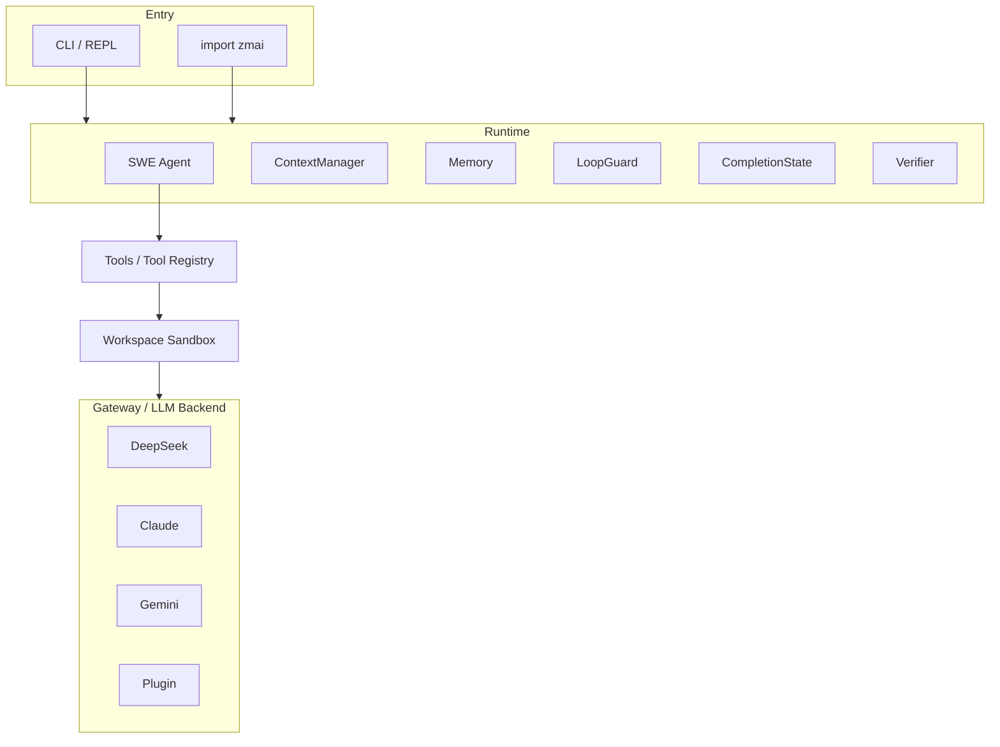

<div align="center">

# ZMAI

**Autonomous Software Engineering Agent Runtime**

[](https://github.com/lip20041219/zmai/actions/workflows/test.yml)
[](https://www.python.org/)
[](LICENSE)
[](pyproject.toml)

`pip install zmai` · **Zero third-party dependencies** · **1311 tests passing**

</div>

---

## 一句话

> **ZMAI** 是一个基于 LLM 的轻量级 SWE Agent，能够自动分析测试失败、定位业务代码、执行修复、运行测试，并在验证成功后停止。

---

## 1. Overview

ZMAI 是一个**开源自主软件工程 Agent 运行时**。给它一个任务（"修复这个 Bug"、"增加这个功能"），它会自主完成：

```
Bug → 分析测试失败 → 定位业务代码 → 修改代码 → 运行测试 → 验证 → 自主停止
```

**它不是简单的 LLM API 封装** —— 从问题理解、测试驱动调试、代码定位、修复规划、验证闭环到完成检测与自主停止，整个 Agent 循环都在本项目内实现。约 2 万行纯 Python 标准库（`urllib` / `subprocess` / `pathlib` / `json`），零第三方依赖。

默认后端为 **DeepSeek**，默认模型 **deepseek-v4-flash**（OpenAI-compatible API）。

---

## 2. Why ZMAI

- **💨 本地 & 私有** — 代码不出你的机器
- **🔌 Provider-agnostic** — 运行时切换 DeepSeek / Claude / Gemini / 自定义插件
- **📦 零依赖** — 纯 Python stdlib，无 `requests` / `httpx` / `pydantic`，无 lock 文件
- **🧩 可嵌入** — `import zmai` 当库用
- **🛡️ 多层防护** — TestGuard / LoopGuard / FixDriving / CompletionState，杜绝空转与伪造成功
- **🛑 自主停止** — 测试全绿即停，不耗尽 token

---

## 3. Core Capabilities

- **SWE Agent 工作流闭环** — 发现 → 先跑测试 → 分析失败 → 修改代码 → 验证
- **FailureParser** — 从 pytest traceback 语义化解析失败根因（expected / actual / line / 候选业务文件）
- **FixPlanner** — 基于失败解析自动生成"诊断→计划→修改→验证"的有序修复计划
- **TestGuard** — 测试文件只读保护，杜绝通过改测试 / 删测试 / 放宽断言伪造成功；并按基线测试数拦截套件收缩
- **LoopGuard** — 相同调用 / 相同失败 / 无进展 三重循环检测
- **FixDriving** — 测试失败后强制进入修改阶段，阻断"只读不修"空转
- **ReadCache** — 重复读取同一未变化文件自动命中缓存并提示复用，避免无效 read
- **CompletionState** — 跨轮累积完成判定，测试全绿立即停止
- **Verifier** — 客观验证（auto_verify），不因"工具调用成功"就判定任务完成
- **Workspace Sandbox** — 路径穿越防护、文件大小限制、符号链接检测
- **Multi-model Gateway** — 统一 Backend 接口 + 加密凭证存储

---

## 4. Architecture



**Layer flow**: `CLI/API → Runtime → SWE Agent → Tools → Workspace → Gateway → LLM Backend`

---

## 5. Bug-fixing Workflow

这是 ZMAI 已经真实验证的完整修复闭环：

```
Bug
 ↓
pytest failure          ← 先跑测试，看到失败
 ↓
FailureParser           ← 语义化解析失败根因（expected / actual / line / 候选文件）
 ↓
candidate localization  ← 定位到业务源码文件
 ↓
FixPlanner              ← 生成"诊断→计划→修改→验证"修复计划
 ↓
ReadFile                ← 读取相关源码
 ↓
Edit                    ← 最小、定向修改业务代码
 ↓
pytest                  ← 重跑测试验证
 ↓
verification            ← Verifier 客观确认全绿
 ↓
complete                ← CompletionState 判定完成，自主停止
```

---

## 6. Demo

<video src="docs/zmai-demo.mp4" width="720" autoplay loop muted controls></video>

一行命令修复真实 Bug：

```bash
zmai "Fix the ValueError in parse_config() — the function crashes on empty input"
```

---

## 7. DeepSeek Backend

ZMAI 默认使用 **DeepSeek** 后端：

| Backend | Default Model | Notes |
|---|---|---|
| **DeepSeek**（默认） | `deepseek-v4-flash` | OpenAI-compatible API，低成本 |
| **Claude** | `claude-sonnet-4-6` | Anthropic Messages API |
| **Gemini** | `gemini-2.0-flash` | Free tier 可用 |
| **Plugin** | *any* | 自带 20 行 Python 文件即可接入 |

- DeepSeek 走 OpenAI-compatible 端点，`base_url` + `api_key` 即可配置
- 通过 `zmai auth setup` 加密存储凭证，或环境变量 `DEEPSEEK_API_KEY`

---

## 8. Safety Guards

ZMAI 内置多层防护，防止空转、伪造成功与无限循环：

- **TestGuard** — 测试文件（`tests/`、`test_*.py`、`*_test.py`、`conftest.py`）只读；拦截编辑测试、删除测试、放宽断言、修改 pytest 配置；并按**基线测试数**拦截"套件收缩"伪造成功
- **LoopGuard** — 检测连续相同调用 / 相同失败 / 无进展，触发结构化恢复信号
- **FixDriving** — 测试失败后达到读取阈值即强制进入修改阶段，结构性阻断继续只读
- **CompletionState** — 跨轮累积完成判定；partial_green（子集全绿未达基线）不完成、不累计，强制运行完整套件
- **Workspace Sandbox** — 路径穿越防护、文件大小限制、符号链接检测
- **Hard stop** — `max_steps=300` 硬上限，杜绝无限循环

---

## 9. Verification

ZMAI 的完成判定依赖**客观验证**而非工具调用成功：

1. pytest `exit_code == 0`
2. `verify_test_output()` 通过（解析测试输出）
3. 测试套件覆盖达到基线（`parse_test_totals`）
4. `CompletionState.should_complete()` 为真
5. 测试通过后无新的业务修改

满足以上条件后返回 `complete`，Runtime 立即 `break`，不再调用 LLM / read / edit / pytest。

---

## 10. Installation

```bash
git clone https://github.com/lip20041219/zmai.git
cd zmai
python -m venv .venv
.venv/Scripts/activate          # Windows; Unix: source .venv/bin/activate
pip install -e ".[dev]"
```

---

## 11. Quick Start

```bash
# 配置 API key（加密存储）
zmai auth setup

# 或设置环境变量
export DEEPSEEK_API_KEY=***        # 或 ANTHROPIC_API_KEY / GEMINI_API_KEY

# 运行一次任务
zmai "Create hello.py and run it"

# 交互式 REPL
zmai
```

---

## 12. Configuration

ZMAI 配置按优先级解析：**file → env → CLI**。

- `zmai.json` / `zmai config set <key> <value>` — 文件配置
- 环境变量 — `DEEPSEEK_API_KEY`、`ANTHROPIC_API_KEY` 等
- CLI 参数 — `--backend`、`--max-steps`、`--json`

常用项：

| 配置 | 默认 | 说明 |
|---|---|---|
| `backend` | `deepseek` | 默认后端 |
| `runtime.max_iterations` | `300` | Agent 最大步数（`--max-steps`） |
| `timeout` | `30` | 工具执行超时（秒） |
| `fix.read_limit` | `3` | 失败后允许的只读诊断文件数 |

---

## 13. Testing

```
pytest

1311 passed, 9 skipped
```

- 测试覆盖 auth、credential store、gateway、runtime、loop guard、termination、workspace security、SWE workflow、CLI 等
- **无需 API Key 即可运行**（mock backend）
- CI 运行于 Ubuntu + Windows × Python 3.10/3.11/3.12

> ⚠️ 测试结果 ≠ SWE-bench 成绩。本项目**尚未发布**公开标准基准（SWE-bench Full/Verified/Lite）分数。内部真实运行的验证数据见 [BENCHMARK.md](BENCHMARK.md)。

---

## 14. Project Structure

```
zmai/
├── src/zmai/
│   ├── agent/            # Agent 抽象
│   ├── cli/              # CLI 入口（REPL / 单次任务）
│   ├── gateway/          # 多后端网关（DeepSeek / Claude / Gemini / 插件）
│   ├── runtime/          # Runtime 执行循环
│   ├── swe/
│   │   ├── agent.py      # SWE Agent 主逻辑
│   │   ├── completion.py # CompletionState 完成判定
│   │   ├── loop_guard.py # LoopGuard 循环保护
│   │   ├── failure.py    # FailureParser 失败解析
│   │   ├── fix_planner.py# FixPlanner 修复规划
│   │   ├── verifier.py   # Verifier 客观验证
│   │   └── tools.py      # 工具（含 TestGuard / ReadCache）
│   ├── workspace/        # Workspace Sandbox
│   └── ...
├── tests/                # 1311+ 测试
├── examples/             # 使用示例
└── docs/                 # 文档 / zmai-demo.mp4
```

---

## 15. Limitations

- **Shell 执行风险** — `shell_exec` 直接在本机运行命令；headless 模式**无确认提示**，请视为可信贡献者
- **凭证加密为混淆而非硬件级** — 密钥文件与凭证同机，本地加密防 casual 读取
- **尚未发布标准基准** — 无官方 SWE-bench 分数；内部数据见 BENCHMARK.md，勿跨项目对比
- **Windows 优先** — 内置命令翻译与 UTF-8 处理，但 Linux/macOS 覆盖以 CI 为准

---

## 16. Roadmap

- **Better sandbox** — Docker sandbox 默认、命令 allowlist
- **Multi-agent** — 并行任务编排
- **SWE-bench 评估** — 发布真实 SWE-bench Lite pass@1（计划中，未完成）
- **Context compaction** — 更强的长上下文策略
- **macOS CI 覆盖**

---

## 17. License

MIT © ZMAI Contributors — see [LICENSE](LICENSE).

---

## Contributing

See [CONTRIBUTING.md](CONTRIBUTING.md) and [CODE_OF_CONDUCT.md](CODE_OF_CONDUCT.md). Changes follow [CHANGELOG.md](CHANGELOG.md).

## Security

See [SECURITY.md](SECURITY.md). Report vulnerabilities privately.
